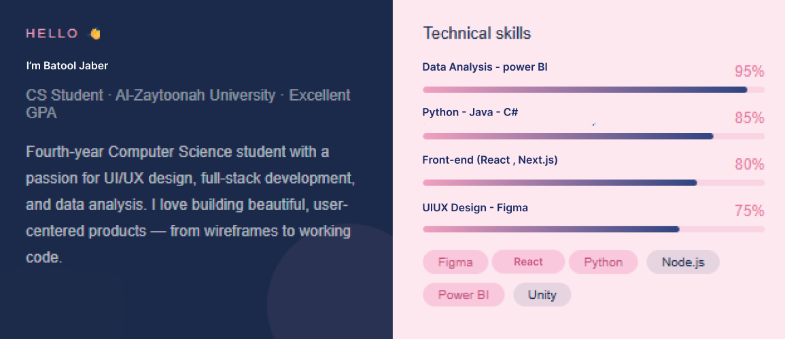

## Hi there 👋

  

 

## Here's a bit about me:

- 🎓 Computer Science student passionate about blending creativity with programming logic.  
- 🌱 Currently learning **TypeScript** and deepening knowledge in **UI/UX Design principles**.  
- ♟️ Fun fact: I love playing chess 🏰♞ — I enjoy challenges and strategic thinking!  
- 🤖 I leverage AI tools to accelerate idea generation and streamline development and design workflows ✨, but every line of code and every design decision reflects my personal skills 💻🎨.
 

##  Languages & Tools:

 
  <!-- Frontend -->
  
  
  
  
  
  
  
  <!-- Backend -->
  
 
  <!-- Languages -->
  
  
  
  

  <!-- Design & Tools -->
  
  
  
  
  

 

## 🤝 Let's Connect

  
  

